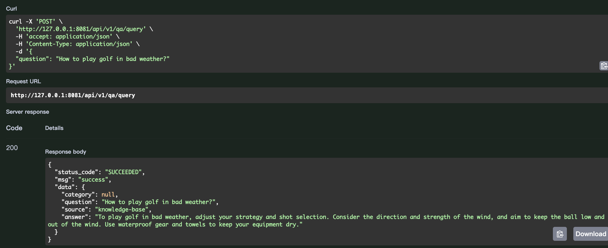
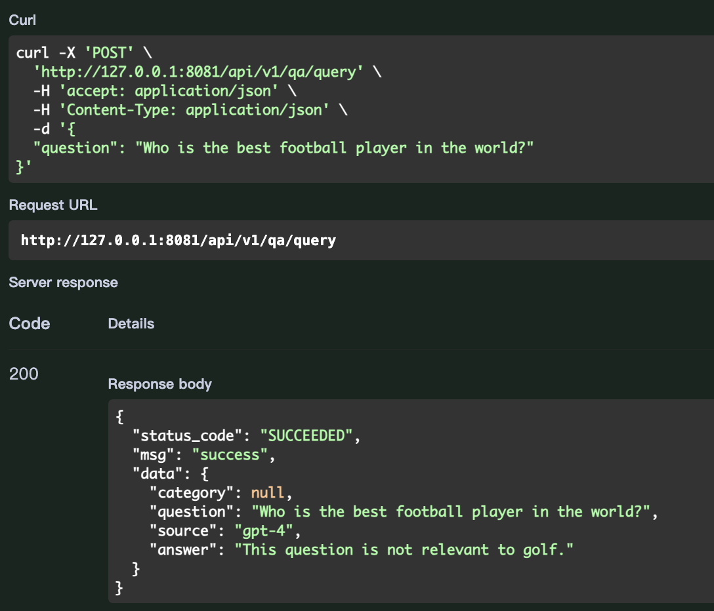

## A low cost solution of a question answering bot based on local database, on top of llama index and fastapi

- if user asks a question, the bot will try to match the question and find the answer from local database first
- local database is a csv file of question/answer pairs, which is embedded(vectorized) by llama index when first run
- if no good matches found, the bot then call openAI's chatgpt api to get the answer, and insert the question/answer
  pair into the index. so next time the bot will be able to answer a similar question from local database
- if the question is not relevant to the topic(in our case the topic is Golf), the bot will call openAI's chatgpt api to
  get the answer

#### When asking a question in the knowledge base



#### When asking a question which is not relevant to the topic



## More details

- the bot uses fastapi as the web framework, and llama index as the search engine
- during the first run, csv file is transformed into jsonl file and then embedded by llama index as index(guess why I do
  this?)
- the bot uses https://api.openai.com/v1/embeddings for embedding. it is very cheap and with high performance
- the bot uses https://api.openai.com/v1/chat/completions to ask chatgpt for answers. by default gpt-3.5-turbo is used
  as the model
- concurrency is naturally supported

## Next steps

- advanced index management, such as index update, index pruning or remove, etc
- use openAI's Assistant API as the search engine(I've already tried, but it is not as good as llama index at the
  moment)
- try and compare different embedding methods and llm models.
- more test cases

## Development

- Setup Environment

```shell
virtualenv -p python3.9 env
source env/bin/activate
pip install -r requirements.txt
```

- Run the application locally

```shell
PYTHONPATH=. python app/launch.py
```

- [Api doc](http://127.0.0.1:8081/docs)


- Test cases(for local tests)
    - write test cases in /app/tests/test_*.py
    - need to pass local test cases before commit

```shell
pytest -ss
```

## Reference

- [llama index official demo doc: fullstack_app_guide](https://docs.llamaindex.ai/en/stable/understanding/putting_it_all_together/apps/fullstack_app_guide.html)
- [llama index official demo code: flask_react](https://github.com/logan-markewich/llama_index_starter_pack/tree/main/flask_react)
