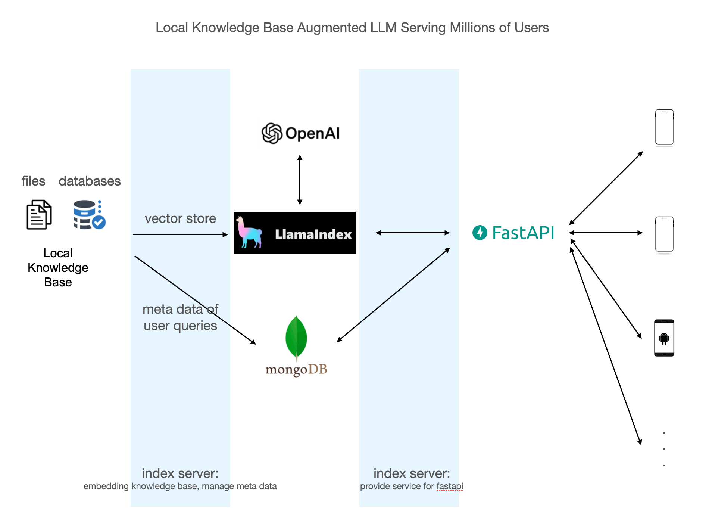

## A Local Knowledge Base Augmented LLM able to serve millions of users, on top of llama index, fastapi and MongoDB



there are 2 modes: question answering mode and chatbot mode.

### question answering mode

- local knowledge base origins from a csv file of standard question/answer pairs. the standard questions are embedded(
  vectorized) by llama index when first run; while the standard answers are stored in MongoDB. the questions and answers
  are intended to be decoupled and saved in different places
- if user asks a question, query engine will try to find a matched question from local database, and if found, the bot
  will then query MongoDB to get the answer
- if no good matches found, the bot then call openAI's chatgpt api to get the answer, and insert the question into the
  index. so next time the bot will be able to answer a similar question from local database
- if the question is not relevant to the topic(in our case the topic is Golf), the bot will refuse to answer

### chatbot mode

- currently in development

#### When asking a question in the knowledge base


#### When asking a question which is not relevant to the topic


## More backgrounds

- the bot uses fastapi as the web framework, llama index as the search engine, MongoDB as the metadata storage
- during the first run, csv file is ingested and the questions are embedded by llama index as vector store, and the
  answers and other metadata are stored in MongoDB
- the bot uses https://api.openai.com/v1/embeddings for embedding. it is very cheap and with high performance
- the bot uses https://api.openai.com/v1/chat/completions to ask chatgpt for answers. by default gpt-3.5-turbo is used
  as the model
- concurrency is naturally supported

## Next steps

- currently the bot only supports question answering. plan to support chat as well.
- use openAI's Assistant API as the search engine(I've already tried, but it is not as good as llama index at the
  moment)
- more test cases

## Development

- Setup Environment

```shell
export OPENAI_API_KEY=your_openai_api_key
virtualenv -p python3.9 env
source env/bin/activate
pip install -r requirements.txt
```

- Run the application locally

```shell
PYTHONPATH=. python app/main.py
```

- [Api doc](http://127.0.0.1:8081/docs)

```bash
PYTHONPATH=. python app/utils/api-docs/extract_openapi.py app.main:app --out openapi.yaml
python app/utils/api-docs/swagger_html.py < openapi.yaml > swagger.html
python app/utils/api-docs/redoc_html.py < openapi.yaml > redoc.html
```

- Test cases(for local tests)
    - write test cases in /app/tests/test_*.py
    - need to pass local test cases before commit

## Reference

- [llama index official demo doc: fullstack_app_guide](https://docs.llamaindex.ai/en/stable/understanding/putting_it_all_together/apps/fullstack_app_guide.html)
- [llama index official demo code: flask_react](https://github.com/logan-markewich/llama_index_starter_pack/tree/main/flask_react)
